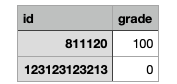
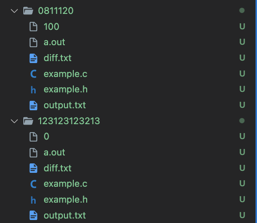

# Permission

```bash
chmod +x ./grade.sh
chmod +x ./cleaner.sh
chmod +x ./preprocessor.sh
```

# 改考卷

1. update Main.c answer.txt

2. 把 zip 檔放到 root 目錄下

3.

```bash
./preprocessor.sh
```

4. $example 是要改的名字 Project01, Midterm 之類的

```bash
./grade.sh $example
```

5. 分數會在 root 目錄下的 grade.csv 但只會分辨 100 跟 0

   

6. 每個人的 output 跟他的 diff 會在他的資料夾下面

   - output.txt 他輸出的檔案
   - diff.txt 他跟 answer.txt 的 diff

   

# Clean

```bash
./cleaner.sh
```
